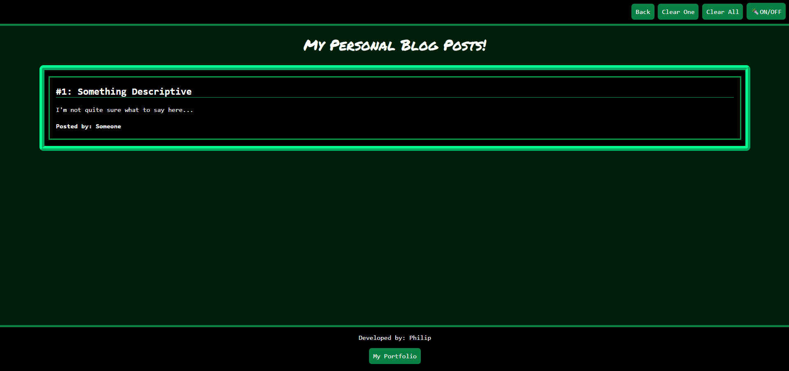

# Personal Blog

## Description

This webpage is designed to showcase the thoughts and experiences of a student or of any individual who wishes to write personal blog posts. This was a great opportunity to practice coding between multiple different files while incorporating specific features. The process took a lot of experimenting and researching, but I gained a great deal of experience and developed a product that I'm proud of.

## Usage

To open the Personal Blog, click this link here to go directly!

[Personal Blog Webpage](https://geovko.github.io/personal-blog/)

*OR* Copy this link to paste it into a browser.
  ```md
https://geovko.github.io/personal-blog/
  ```

In the starting page, the user will need to provide text for three input sections: Username, Blog Title, and Blog Content. Pressing the 'Submit' will direct the user to the second page. However, if any of the input sections is left blank, the user will not be directed and will instead be prompted to fill the missing section(s). In the second page, the user can view all of the blog posts that have been stored into the current browser. 

Both pages have a header and a footer. The header contains a button (🔦ON/OFF) to toggle light/dark mode. Clicking on this will change the current page to a light or dark theme. The footer contains the developer of the webpages (i.e., me) as well as a link to my website portfolio. The header for the second page, however, has three extra buttons: Back, Clear One, and Clear All. The Back button takes the user back to the first page where they can write another blog post. while the Clear button clears a single blog post that the user chooses, the Clear All button will clear the entire list of blog posts. 

First Page: Light 


Second Page: Light 


First Page: Dark 


Second Page: Dark 


## Credits

This project wouldn't have been completed without the aid of tutorials and assignments provided by the UCI Bootcamp teaching staff.

## License

MIT License


